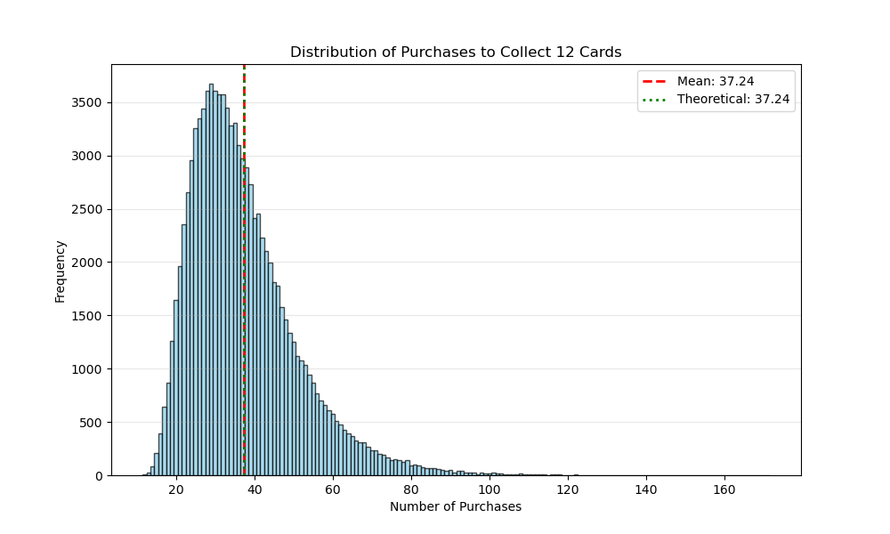

+++
title = '集滿卡組有多難'
date = 2026-02-17T20:49:59+08:00
categories = ['筆記']
tags = ['數學']
+++

這是個高中數學課本等級的簡單題目，維基百科上稱為[彩券收集問題](https://zh.wikipedia.org/zh-tw/%E8%B4%88%E5%88%B8%E6%94%B6%E9%9B%86%E5%95%8F%E9%A1%8C)。然而我遇到的當下居然想錯，所以來筆記一下。

### 核心問題
**題目**：卡片販賣機有 \\( \frac{1}{12} \\) 的機率掉任一張卡，問集滿全套 12 張卡的期望購買次數為何？

**答案**：\\( \frac{12}{12} + \frac{12}{11} + \dots + \frac{12}{1} \\) 約為 37.24。

**延伸題目**：隨卡片張數增加，期望次數的增加趨勢為何？

**延伸題目答案**：\\(O(n\log n)\\)

**延伸題目錯解**：拿到第 11 張卡後，要集到最後的第 12 張卡，期望得抽 12 次。於是 \\( E(12) = E(11) + 12 \\)，從而 \\(E(n) = E(n-1) + \Theta(n) = O(n^2)\\)。

---

### 詳解
#### 集卡過程
要集滿 12 張卡，我們必須經過 12 個階段：
- 集到第 1 張卡
- 集到第 2 張不一樣的卡
- 集到第 3 張不一樣的卡
- ...
- 集到第 12 張不一樣的卡

每個階段的期望次數總和就是答案。

#### 集到新卡所需的期望次數
假設我已經有 5 張不一樣的卡了，集到第 6 張所需的期望次數是多少呢？

每抽一次有 \\( \frac{5}{12} \\) 的機率會抽到重複的，\\( \frac{7}{12} \\) 的機率會抽中新卡。\\( \frac{7}{12} \\) 的中獎率，[期望要抽的次數就是它的倒數](#why-reciprocal) \\( \frac{12}{7} \\)。

#### 集滿 12 張卡的期望總次數
$$
\frac{12}{12} + \frac{12}{11} + \frac{12}{10} + \dots + \frac{12}{1} \approx 37.24
$$

#### 卡集張數與期望次數的關係
| 卡集張數 | 1 | 2 | 3 | 4 | 5 | 6 | 7 | 8 | 9 | 10 | 11 | 12 |
| --- |  --- | --- | --- | --- | --- | --- | --- | --- | --- | --- | --- | --- |
| 期望次數 | 1.00 | 3.00 | 5.50 | 8.33 | 11.42 | 14.70 | 18.15 | 21.74 | 25.46 | 29.29 | 33.22 | 37.24 |

| 卡集張數 | 13 | 14 | 15 | 16 | 17 | 18 | 19 | 20 | 21 | 22 | 23 | 24 |
| --- |  --- | --- | --- | --- | --- | --- | --- | --- | --- | --- | --- | --- |
| 期望次數 | 41.34 | 45.52 | 49.77 | 54.09 | 58.47 | 62.91 | 67.41 | 71.95 | 76.55 | 81.2 | 85.89 | 90.62 |

公式：$$ n \times (\frac{1}{n} + \frac{1}{n-1} + \frac{1}{n-2} + \dots + \frac{1}{1}) $$

右項為[調和級數](https://zh.wikipedia.org/zh-tw/調和級數)，複雜度為 \\( \log n \\)。故集滿 n 張卡集的期望次數複雜度為 \\( O(n \log n) \\)。

---

### 附錄
#### 為什麼期望要抽的次數就是中獎率的倒數？ {#why-reciprocal}
解釋一，寫給 12 歲時的自己：
> 中獎率砍半，期望要抽的次數就加倍，所以是反比關係。<br>
為什麼中獎率砍半，期望要抽的次數就加倍呢？<br>
<br>
我們可以從這個問題入手：一副撲克牌抽到紅Ａ（中獎率是抽到Ａ的一半）所需的期望次數是多少？<br>
抽牌的實驗過程，可以改成從 13 張牌中抽一個數字，抽到Ａ之後再擲硬幣決定是紅是黑，黑則重來。
寫成算式就是 $$ E_{\frac{1}{13}\times\frac{1}{2}} = (\frac{1}{2})^0E_\frac{1}{13} + (\frac{1}{2})^1E_\frac{1}{13} + \dots + (\frac{1}{2})^\infty E_\frac{1}{13}$$
然後我們知道「日取其半，萬世不竭」，所以右式為 \\( 2E_{\frac{1}{13}} \\)。<br>
<br>
以上 \\( E_{\frac{1}{13}} \\) 可以換成其他任何數字，所以「中獎率砍半，期望要抽的次數就加倍」。

解釋二，適合高中參考書：
> $$
\begin{aligned}
期望抽數 &= 可能性甲發生機率 \times 可能性甲的抽數 + 可能性乙發生機率 \times 可能性乙的抽數 + 可能性丙\dots \\\\
期望抽數 &= 一抽即中機率 \times 1抽 + (未能一抽即中機率) \times (1抽 + 再接再厲的期望抽數)
\end{aligned}
$$
第一抽抽到重複的情況，對接下來的處境沒有任何幫助，所以再接再厲的期望抽數就是當下的期望抽數。算式整理一下，可得
$$
\begin{aligned}
期望抽數 &= 一抽即中機率 \times 1抽 + (未能一抽即中機率) \times (1抽 + 期望抽數) \\\\
期望抽數 &= 1抽 + (1 - 一抽即中機率) \times 期望抽數 \\\\
期望抽數 &= \frac{1}{一抽即中機率} \\\\
\end{aligned}
$$

#### 錯解何錯
我起初想：「拿到第 11 張卡後，要集到最後的第 12 張卡，期望得抽 12 次。於是 \\( E(12) = E(11) + 12 \\)，從而 \\(E(n) = E(n-1) + \Theta(n)\\)。」

然而上述 \\(E(11)\\) 是在 12 張卡組中集到 11 張，應該寫成 \\( E_{12}(12) = E_{12}(11) + 12 \\)。並無 \\( E_{12}(12) = E_{11}(11) + 12 \\)，亦無 \\(E_{12}(11) = E_{12}(10) + 11 \\)。

#### 模擬集 12 張卡所需次數


```python
import random
import matplotlib.pyplot as plt

def f():
    cnt, collected = 0, set()
    while len(collected) < 12:
        collected.add(random.randint(0, 11))
        cnt += 1
    return cnt

trials = 100000
results = [f() for _ in range(trials)]

plt.figure(figsize=(10, 6))
plt.hist(results, bins=range(min(results), max(results) + 2), align='left',
         color='skyblue', edgecolor='black', alpha=0.7)
plt.axvline(sum(results)/len(results), color='red', linestyle='dashed',
            linewidth=2, label=f'Mean: {sum(results)/len(results):.2f}')
plt.axvline(37.24, color='green', linestyle='dotted', linewidth=2,
            label='Theoretical: 37.24')

plt.title('Distribution of Purchases to Collect 12 Cards')
plt.xlabel('Number of Purchases')
plt.ylabel('Frequency')
plt.legend()
plt.grid(axis='y', alpha=0.3)

plt.savefig('histogram.png')
print("Histogram saved as histogram.png")
plt.show()
```


