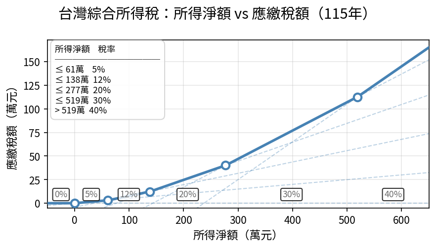

+++
title = '免稅額給長輩'
date = 2026-04-27T22:49:30+08:00
categories = ['心得']
tags = ['金融']
+++
### 源起
我今年首次報全年所得稅。研究了一番發現，過去幾年我沒有技巧性把免稅額給父母用，浪費了。寫成文章看讀者有沒有機會用。

### 先說結論
> 由無收入的小孩申報扶養 60 歲以上有收入的父母

孩子未成年或具學藉時，父母可以申報扶養，使用小孩的免稅額。

至於孩子成年失去學藉後，雖然父母不能申報扶養孩子，但若父母超過 60 歲，可由無收入的孩子申報扶養父母。等於還是可以合併使用免稅額。

不過還是有些細節會影響效果，實務上只要各種方式都用報稅系統試算一遍，肯定不虧。

### 分析和模擬案例
#### 累進稅率按家戶申報是否懲罰婚嫁？
在臺灣繳過所得稅的人大概都知道，臺灣的[綜合所得稅級距](https://www.ntbt.gov.tw/multiplehtml/1b82b380e1a34de9afd204d39b007db2)是不分單身和家庭的。總所得越高，繳的稅就愈高。以 115 年為例：

- 兩個薪資年收百萬的個人戶，淨所得皆為 \\(100 - 9.7_{免稅額} - 21.8_{薪資扣除額} - 13.1_{標準扣除額} = 64.4\\) 萬，所得稅分別為 \\(64.4 * 12\\% - 4.27 = 3.458\\) 萬。共計 \\(6.916\\) 萬。
- 一對總薪資兩百萬的夫妻戶，淨所得共為 \\(100 - 9.7_{免稅額} - 21.8_{薪資扣除額} - 13.1_{標準扣除額}) * 2 = 128.8\\) 萬，所得稅共計 \\(128.8 * 12\\% - 4.27 = 11.18\\) 萬。

制度顯然不利高所得者結婚。於是國稅局提出了「合併申報分開計稅」的五種選項，免得有錢人都不結婚。

#### 夫妻分別計稅的五種情形選擇
國稅局有舉例[合併申報分別計稅的案例試算](https://www.etax.nat.gov.tw/etwmain/tax-info/understanding/tax-saving-secret/GYvNwBz)。看起來有些複雜，但如果先不理股利分開計稅，只討論五種狀況，其實很簡單。

一對夫妻計入所得稅的項目如圖，實線為正值、虛線為負值。一般是第零種情形，合併課稅。也就是整包拿去量級距計稅。

這時如果有一塊很大，就會拉高級總體級距。於是國稅局說：
> 我們允許整包分切成兩段，左右分別量級距計稅，計完加總。
> - 同一落的不能切分。例如夫的租賃所得和利息所得都屬非薪資所得，必為同一段。
> - 不能切兩刀或排列組合，就是按這個順序分左右兩段。也就是說一旦要分切，雙方的免稅額一定會分在不同段。

合法的切法只有圖示四種，

#### 夫妻分別計稅的例子{#splitting-example}
一般來說，最好的切法就是切出兩段金額最接近的。例如：
- 妻有薪資 71.8 萬，利息 1 萬，夫有租金 50 萬，薪資 121.8 萬。那就會選切夫之薪資所得。
- 妻有薪資 121.8 萬，利息 50 萬，夫有租金 100 萬，薪資 121.8 萬。那就會選切妻之各項所得。

以上五種分法，納稅人通常不知道也沒什麼關係，報稅系統會自動帶入五種切法，算出最少的課。比較在意的夫妻，則可以安排租金誰賺，使得兩段能切得平均。

#### 給孩子扶養的第五、六、七種情形
現在把未婚獨子也加入計畫。其計入所得稅的項目如圖。

然而未婚獨子很可能還在找工作、出國工作不用報薪資、時薪八塊半等等……實際上列報的所得比免稅額還少。

如果把舉例的夫妻和孩的稅單放一起看。會發現三段金額大小實在太不平均，孩子那段是負值。

可以試算若孩子扶養丈夫，兩戶的總稅額有沒有變少；同理，也可以試算孩子扶養妻子；若有其它孩子，也可以各養一人。

若夫妻原稅率都是 20%，那由孩子申報扶養最多可以省到 \\(9.7 * 20\\% = 1.94\\) 萬。夠孩子來回澳洲一趟了。 

#### 顯不適合給孩子扶養的情形
- 孩子有賺超過免稅額，但沒超過標準扣除額。這種情況下，將夫妻拆分成被扶養人，會使夫妻戶的標準扣除額剩一半，而孩子戶剩於的標準扣除額不足以抵銷。
- 夫妻戶選切一方之薪資所得。這種情況下，夫妻利用配偶分別計稅偷開外掛，把單一方賺的錢拆成兩包計稅（如[例一](#splitting-example)）。若孩子扶養則無法達到這種效果。夫妻應先考慮把所得分配給另一方，孩子的免稅額才能發揮作用。


