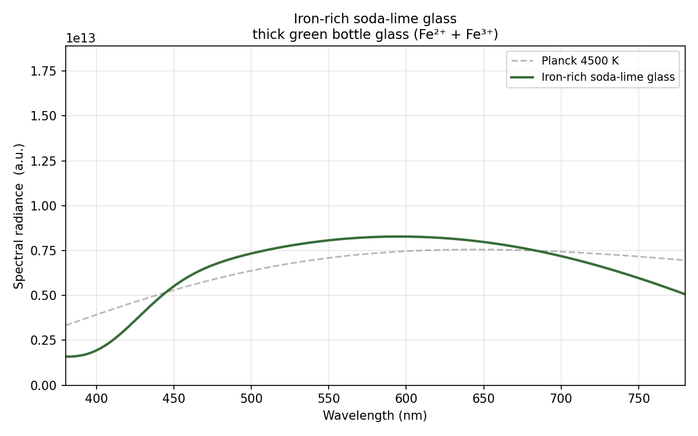
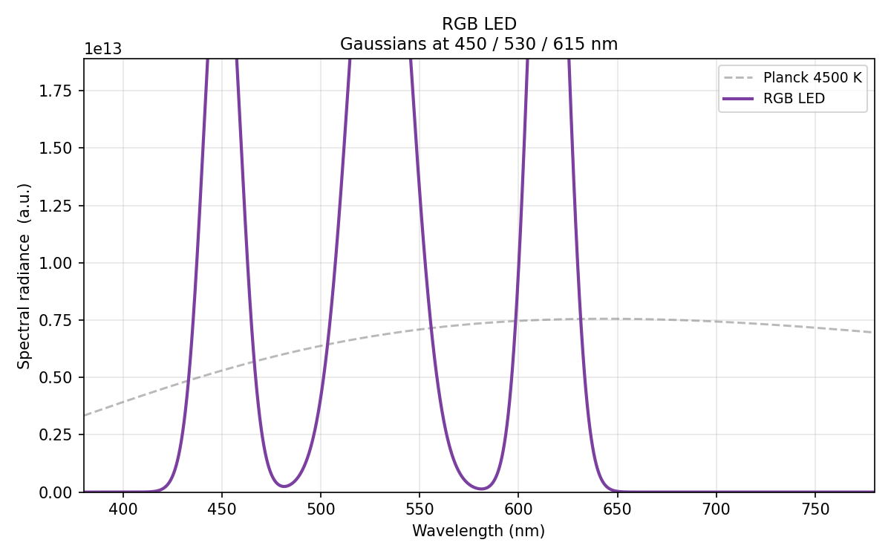
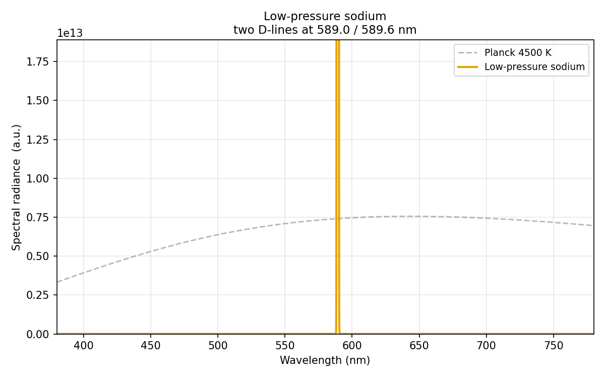
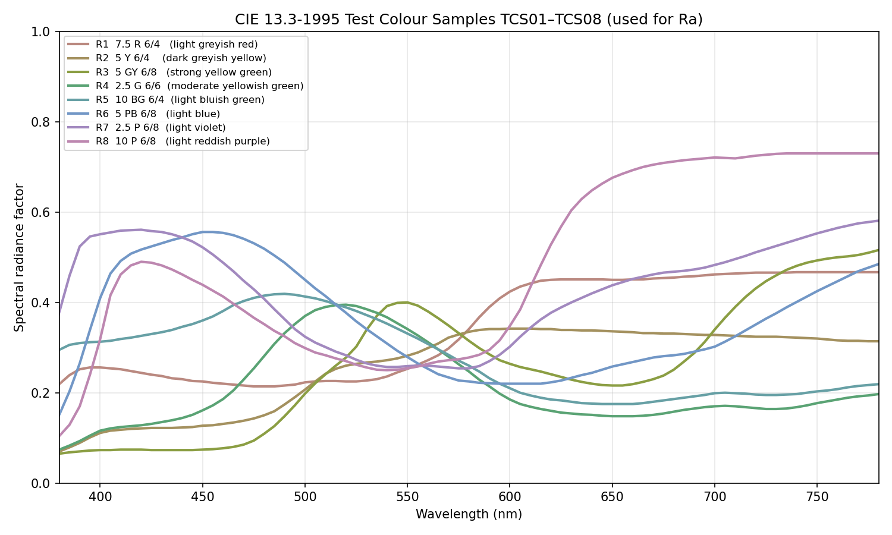

+++
title = '燈泡演色率'
date = 2026-07-29T00:26:00+08:00
categories = ['筆記']
tags = ['數學']
+++

### 買燈泡
我和爸爸一起去買高演色率燈泡。全聯和家樂福都只有賣 Ra 80 的燈泡。

我們接著去生活五金找，LED 燈的 Ra 也至多 80…… 
我：「咦？鎢絲燈耶！這個 Ra 100！」 
爸：「還是你陽台要用鎢絲燈？我小時候都用這個。」 
我：「嗯，小顆的 40 瓦，我好像從來沒用過鎢絲燈耶。」 
我：「啊，國中小自然課接電路，有用過旁邊這種小粒的。我還記得國中自然課時，老師調高電源供應器電壓，讓燈泡亮極後燒掉。一群國中生光這樣就很興奮。可見我的國中同學們也沒用過鎢絲燈。」

最後我們在特力屋買到 Ra 90 的燈泡。

買回來裝上後，改變其實並不明顯。不過拿鈔票出來看的話，就能感受到差別。

### 演色率
我裝完燈泡後才去認真查 Ra 的定義。一查發現比我想得複雜超多。難怪沒有人解釋給我聽過。

#### 我以為的演色率量法
[演色率越高，越接近太陽光產生的光](https://jinholm.github.io/posts/%E6%8E%A8%E5%9D%91/)嘛。討論燈光的顏色，也就是燈的光譜，越接近太陽的光譜（黑體輻射）應該要越高分。最簡單的算分方式就是看兩道光譜重疊的比例。
| 分數 |  94 分 | 37 分 | 1 分 |
| --- | --- | --- | --- |
| 光譜 |  |  |  |

然而實際上不可能這樣算分。因為「演色率」這個指標是燈泡廠拿來量化「這個 LED 光譜**人眼**看起來就跟黑體一樣」用的。所以必須加入人眼的色彩邏輯。且退一步說，燈泡廠很可能是要調整三種 LED 成分光譜的比例，來最大化指數。然而如上表中間的例子，三個峰的高度怎麼微調根本都不會改變分數，所以這個分數沒什麼參考價值。

#### 實際上的演色率量法
*我寫完才發現[這裡](https://www.ncir.niar.org.tw/Files/Doc/Publication/InstTdy/177/01770480.pdf)有中文介紹*

1. 把燈泡放進[積分球](https://en.wikipedia.org/wiki/Integrating_sphere)量光譜。
2. 把整道光譜轉到 [UCS 色彩空間](https://zh.wikipedia.org/zh-tw/CIE1960%E8%89%B2%E5%BA%A6%E7%A9%BA%E9%97%B4)的一個點，代表燈泡的顏色。
3. 選各種溫度的黑體光譜，看誰轉到 UCS 空間的數值跟燈泡最接近，就拿該溫度的光譜當這顆燈泡的 Ra 100 標準光譜。
4. 選好標準光譜後，分別拿燈泡和標準光譜去照八張標準色票，量出 16 道反射光譜。（現代當然是電腦模擬照的結果，不是真的買色票來照）
5. 把 16 道光譜轉到 UCS 色彩空間後，拿 3. 的偏差對八道燈泡光譜做馮克里斯色適應公式校正。[參考資料](https://zhuanlan.zhihu.com/p/361035719)
6. 再把校正過的 16 筆 UCS 顏色捉對轉到 [\\( W^\*U^\*V^\* \\) 均勻色空間](https://en.wikipedia.org/wiki/CIE_1964_color_space)，算距離。
7. 每組距離乘 4.6，就是該色票的扣分，每色票的得分寫作 \\( R_1, R_2...R_8 \\)。此八數的平均值就是 Ra。

#### 追求更科學的演色率量法
我個人覺得，用一群古人選的八張色票當標準，實在不太科學。後續大家也陸續開始關注 R9、R15 乃至上百色的 TM30 系統。或許應該從一開始的算分方式就不要扯上色票比較好。畢竟反射機制、色適應公式和 \\( W^\*U^\*V^\* \\) 均勻色空間，已經有反映「人眼」的感受了。

我想了兩個方向，好像都不太可行。
1. 直接把兩道光譜做某種卷積或方均根計算。不過我想想後，發現「某種卷積」跟「某種色票」好像差不多。這樣既沒改善科學性，又破壞物理意義。
2. 用「所有可能的色票中，最低分者」來打分，就沒有「選色票」的問題了。不過我的 AI 想想後，發現虛擬的色票可以很不現實，使得任何光譜都得零分。如果我要「限制可能的色票範圍」或是「給每張色票一個合理性加分」，好像還是很難訂得科學。


